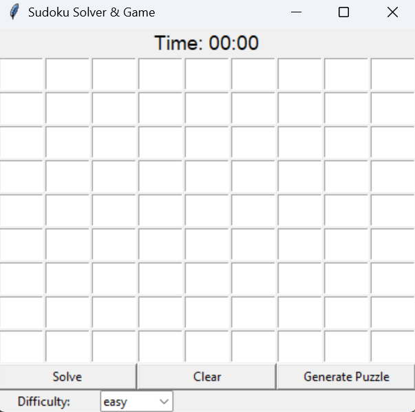
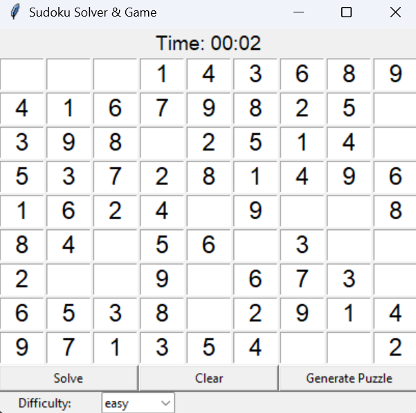
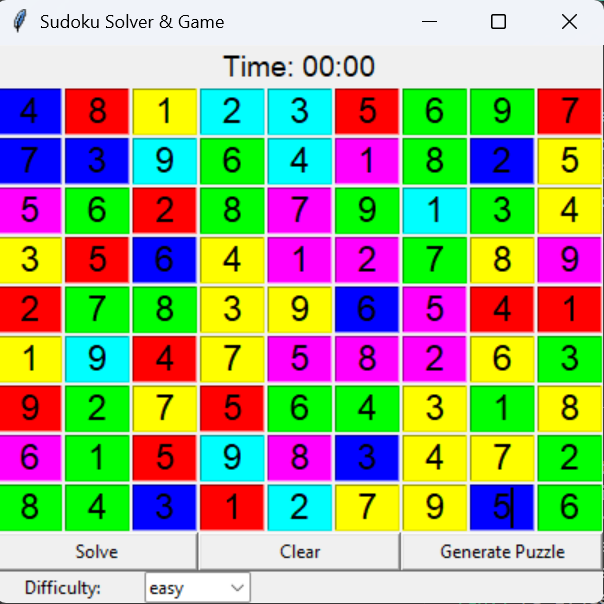

# Sudoku Solver & Game

This is a **full-featured Sudoku game** built using **Python Tkinter**. You can **play Sudoku**, **generate puzzles** with different difficulties, **solve them automatically**, and enjoy interactive features like **wrong number flash** and **celebration when solved**.

## Features

- Solve Sudoku using **backtracking**  
- Generate random Sudoku puzzles with difficulty levels: **easy, medium, hard**  
- **Clear board** to start a new game  
- **Timer** shows how long you have been playing  
- **Wrong numbers flash red** when entered  
- **Celebration glow animation** when the puzzle is solved  

## How to Use

1. Clone the repository: `git clone https://github.com/yourusername/Sudoku-Tkinter.git`  
2. Go to the project folder: `cd Sudoku-Tkinter`  
3. Install Python if you don’t have it (Python 3 recommended).  
4. Run the game: `python main.py`  
5. Features in the game: enter numbers in the grid, click **Solve** to solve automatically, click **Generate Puzzle** to get a new puzzle (choose difficulty), click **Clear** to reset the board, watch the timer, and enjoy the celebration when you solve the puzzle.  

## Demo Images

**Initial Puzzle Example:**  

**Entering Numbers / Wrong Number Flash:**  

**Solved Puzzle Celebration:**  

## Files

- `sudoku_gui.py` - Main Python script to run the Sudoku game  
- `images/` - Folder containing demo images  
- `README.md` - Project description  

## Notes

- This project uses **only Tkinter**, no external libraries required.  
- Works with standard **9x9 Sudoku** boards.  
- Ideal for learning **GUI development** and **backtracking algorithms**.  

## Author

- Devakinandan Sanapala
